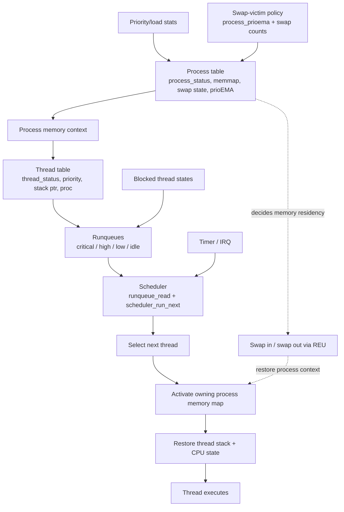

# Process and thread model

This document explains how OS128 models execution, scheduling, and memory ownership across processes and threads.

## Overview

OS128 is structured around a classic process/thread model even though it runs on a very constrained 8-bit machine. The kernel tracks:

- processes
- threads
- current active process and thread
- runqueues and dispatch state
- memory mappings per process
- thread block and wakeup state

The model is implemented largely in the low-memory runtime tables defined in [../../include/memorymap.asm](../../include/memorymap.asm) and the scheduler logic in [../../kernel/scheduler.asm](../../kernel/scheduler.asm).

## Process model

A process in OS128 is the unit of memory ownership and context. Each process has:

- a status flag
- an associated main thread
- a memory map
- swap metadata
- priority/load history used for swap-victim selection
- a name

The process table is defined in the memory map and includes entries such as:

- `process_status`
- `process_ithread`
- `process_names`
- `process_memmap`
- `process_swapmap`
- `process_prioema`
- `process_swapcnt`
- `process_promise`

This means a process is not just an abstract “task”; it is a concrete runtime object with a fixed memory view and scheduling state. The `process_prioema` value is a running average over the priority of the threads within that process that actually consume CPU time. It is used as a swap-victim statistic to help choose which process to evict from memory, not as a direct scheduler priority field used to decide the next runnable thread.

## Thread model

A thread is the actual runnable unit of execution. Each thread has:

- status flags
- priority
- blocking data
- saved stack pointer
- owning process
- pending signals
- parent thread reference
- per-thread execution counters

The thread table is defined in the memory map and includes:

- `thread_status`
- `thread_prio`
- `thread_bdata`
- `thread_sp`
- `thread_proc`
- `thread_signals`
- `thread_parent`
- `thread_countl`
- `thread_counth`

These tables are the heart of scheduling. The kernel does not maintain a modern task object abstraction; it keeps explicit arrays and scalar metadata for every thread and process.

A useful detail is that the process and thread names are not kept in the hot path of the scheduler. Instead, the system stores a compact index or calculated pointer to their name entry, which is only resolved when the name is actually needed for display, debugging, or syscall metadata. That keeps the scheduler-critical data smaller, cheaper to access, and always resident in memory, while still allowing names to exist without making the dispatch loop pay for them on every switch.

## Relationship between process and thread

The model is intentionally simple:

- a process owns a memory context
- a thread executes inside a process context
- the active thread determines the current execution point
- the scheduler loads the owning process context before running a thread

The scheduler code demonstrates this directly:

- it selects `next_thread`
- reads `thread_proc[next_thread]`
- sets `next_process`
- calls `process_context_load`
- then activates the thread state and stack pointer

This is a key architectural pattern in OS128: process and thread are distinct layers, but they are tightly coupled in execution.

## Scheduler-level behavior

At a high level, thread state and runqueue policy are described here, but the detailed scheduling logic belongs in [scheduler.md](scheduler.md).

For the detailed behavior of:

- thread priority and queue assignment
- starvation promotion
- queue selection and dispatch order
- the actual context-switch sequence
- the timer-driven preemption path
- process address activation and swap-in/out logic

please refer to [scheduler.md](scheduler.md).

This document focuses on the conceptual model rather than the exact implementation details.

## Process swapping and memory ownership

Because the C128 is memory-constrained, a process can be swapped out and later restored. The swapper and process tables track whether a process is active in RAM or resident in REU-backed storage.

This is important because a process is not only a task; it is also a memory resident. The OS must restore the correct memory map before resuming a thread.

## Context switching model

At a high level the context switch is explicit and low-level:

1. save current thread stack pointer
2. switch to scheduler stack or scheduler memory environment
3. select next thread
4. activate process memory map
5. restore thread stack pointer and CPU state
6. resume execution

The concrete implementation details of this flow are covered in [scheduler.md](scheduler.md).

## Relationship diagram

This diagram emphasizes the critical separation in OS128:

- the process owns the memory context
- the thread owns the current execution point
- the runqueue decides which thread is eligible next
- the scheduler loads the process context before the thread runs
- swap policy is based on process-level statistics, not direct thread scheduling priority

## Why this model is significant

The main unusual part is that the process/thread model is not abstracted away. It is represented as fixed arrays and flags in a low-memory runtime region, tied directly to the architecture of the machine.

This is not just a stylistic choice. It is a highly practical one. The fixed tables are smaller than a richer object-based representation, which matters when the system is trying to support up to 64 threads and 16 processes in a very tight memory budget. More importantly, the data is cheaper to access because it stays resident in memory and is laid out in compact, indexable arrays. That makes the scheduler hot path much cheaper to walk and update, which matters because this data sits on the critical path of every dispatch decision.

This is one of the main reasons the system can be realistically usable rather than a proof-of-concept. The kernel is trading abstraction for speed, predictability, and constant-time access patterns in exactly the place where performance matters most: the runqueue, process selection, and context switch path.

## Related files

- [../../include/memorymap.asm](../../include/memorymap.asm)
- [../../kernel/scheduler.asm](../../kernel/scheduler.asm)
- [../../kernel/runqueue.asm](../../kernel/runqueue.asm)
- [../../kernel/thread.asm](../../kernel/thread.asm)
- [../../kernel/process.asm](../../kernel/process.asm)
- [../../kernel/interrupt.asm](../../kernel/interrupt.asm)
- [../../kernel/swapper.asm](../../kernel/swapper.asm)
